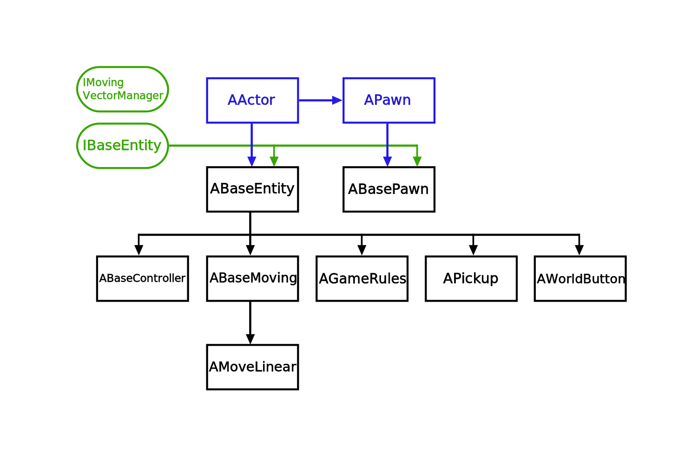

# VRBase Documentation

## Table of Contents
1. [Class Diagram](#diagram)
2. [BaseEntity Lifecycle](#lifecycle)
3. [Specification](#spec)

## Class Diagram 

Be sure to refer to the [specification](#spec) for more information on each class.

## BaseEntity Lifecycle 

> In standard Unreal, the default object initialization order is as follows: 
> 1. All objects are built via their constructors. These are called whenever the game starts, even when in editor. They are also called in the editor when dragging an object into the world.
> 2. `AActor::BeginPlay()` is called on all actors, in no particular order.
> 3. `AActor::Tick()` begins to be called for each actor and will continue to be called every frame.

To provide the greatest flexibility possible, VRBase has its own entity initialization lifecycle. This is the method lifecycle for any given `BaseEntity`:

Be sure to note the following:

1. All objects are built via their constructors.
2. `AActor::BeginPlay()` is called on all actors in no particular order.
3. `IBaseEntity::PreInit()` is called on all [IBaseEntity](IBaseEntity.md)-derived actors.
4. All global Static Initializer Priority 1 functions are called. Between files, order is not guaranteed, but within a file, order is in definition order.
5. All global Static Initializer Priority 2 functions are called; see above.
6. All global Static Initializer Priority 3 functions are called; see above.
7. `IBaseEntity::PostInit()` is called on all [IBaseEntity](IBaseEntity.md)-derived actors.
8. `IBaseEntity::DefaultThink()` and `IBaseEntity::Think()` both begin to be called for each actor and each continue to be called every frame. `IBaseEntity::DefaultThink()` will always be called before `IBaseEntity::Think()` on each frame.
9. `AActor::Tick()` is also called on every frame of the game. On any given frame it may happen before, during, or after `IBaseEntity::DefaultThink()` and `IBaseEntity::Think()`.

## Specification 

### Classes:
- [ABaseEntity](ABaseEntity.md)
  - [ABaseController](ABaseController.md)
  - [ABaseMoving](ABaseMoving.md)
    - [AMoveLinear](AMoveLinear.md)
  - [AGameRules](AGameRules.md)
  - [APickup](APickup.md)
  - [ASign](ASign.md)
  - [AWorldButton](AWorldButton.md)
- [ABasePawn](ABasePawn.md)

### [Globals](globals.md)

### Interfaces:
- [IBaseEntity](IBaseEntity.md)
- [IMovingVectorManager](IMovingVectorManager.md)

### Types

- [FEntityInputRegistrationButtons](FEntityInputRegistrationButtons.md)
- [FEntityInputRegistrationParams](FEntityInputRegistrationParams.md)
- [FMovingVector](FMovingVector.md)
- [FPawnInstruction](FPawnInstruction.md)

_Be sure to also look at VRBase defined [typedefs](typedefs.md)._

### Utilities:

- [EHandle](EHandle.md)
- [LineTools](LineTools.md)
- [NLogger](NLogger.md)
