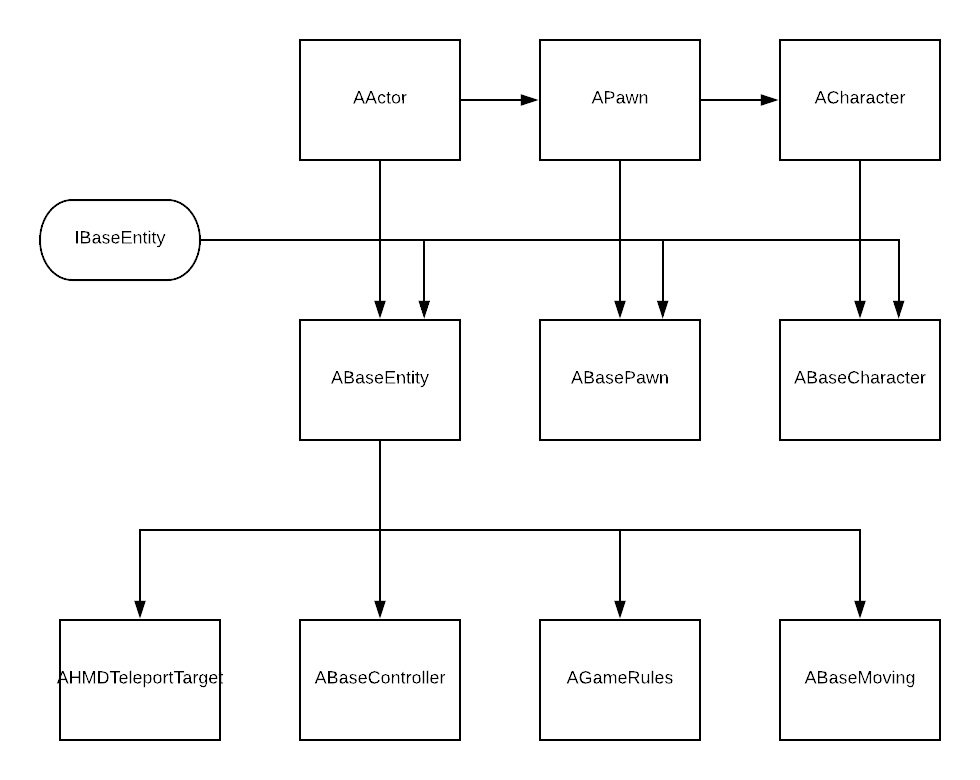

# VRBase Library

VRBase is a C++ Unreal Engine library designed to simplify virtual reality programming in Unreal. It includes a variety of different classes, each of which perform different functions to improve overall user experience.

The VRBase Library implements the Blueprint VR Template in C++. You will not need to program the camera or controllers; this lets you focus on programming your game.

A demo project exhibiting the features of VRBase can be found [here](https://github.com/mmc-scholars/VRBaseDemo).

## Table of Contents
1. [Installation/Setup](#setup)
2. [Initialization Order](#order)
3. [Class Specification](#spec)

## Installation/Setup <a name="setup"></a>

_(Since this is only a library, VRBase should be added to an existing project.)_

1. Clone VRBase into your project under the directory `Source/PROJECTNAME/VRBase`.
2. Right-click the Unreal project in the main root directory and select _Generate Visual Studio Project Files_ in order for the library to appear in the Visual Studio Solution.
3. Update the `PROJECTNAME.Build.cs` file to include VRBase. This file is located in the `Source/PROJECTNAME/` directory. This snippet can be copied and pasted into the file. **Be sure to change the project name**:
```cs
using System.IO;
using UnrealBuildTool;

public class PROJECTNAME : ModuleRules {
	public PROJECTNAME(ReadOnlyTargetRules Target) : base(Target) {
		PCHUsage = PCHUsageMode.UseExplicitOrSharedPCHs;

        PublicDependencyModuleNames.AddRange(new string[] { "Core", "CoreUObject", "Engine", "InputCore", "Slate", "SlateCore" });
        PrivateDependencyModuleNames.AddRange(new string[] { "HeadMountedDisplay", "SteamVR" });
        
        PublicIncludePaths.Add(Path.GetFullPath(Path.Combine(ModuleDirectory, "VRBase")));
    }
}
```

4. After opening the project, VRBase **requires** an instance of AGameRules included in the level for VRBase to function. VRBase classes will not work otherwise.

## Initialization Order <a name="order"></a>

The default object initialization order in Unreal is as follows: 

1. All objects are built via their constructors. These are called whenever the game starts, even when in editor. They are also called in the editor when dragging an object into the world.
2. `AActor::BeginPlay()` is called on all actors, in no particular order.
3. `AActor::Tick()` begins to be called for each actor and will continue to be called every frame.


**VRBase has its own default initialization order. Use the following initialization order instead:**

1. All objects are built via their constructors.
2. `AActor::BeginPlay()` is called on all actors, in no particular order.
3. `IBaseEntity::PreInit()` is called on all IBaseEntity-derived actors.
4. All global Static Initializer Priority 1 functions are called. Between files, order is not guaranteed, but within a file, order is in definition order.
5. All global Static Initializer Priority 2 functions are called; see above.
6. All global Static Initializer Priority 3 functions are called; see above.
7. `IBaseEntity::PreInit()` is called on all IBaseEntity-derived actors.
8. `IBaseEntity::DefaultThink()` and `IBaseEntity::Think()` both begin to be called for each actor and each continue to be called every frame. `IBaseEntity::DefaultThink()` will always be called before `IBaseEntity::Think()` on each frame.
9. `AActor::Tick()` is also called on every frame of the game. On any given frame it may happen before, during, or after `IBaseEntity::DefaultThink()` and `IBaseEntity::Think()`.

## Class Specification <a name="spec"></a>



### [Globals](Doc/globals.md)

### Classes:
- [ABaseCharacter](Doc/ABaseCharacter.md)
- [ABaseEntity](Doc/ABaseEntity.md)
  - [ABaseController](Doc/ABaseController.md)
  - [ABaseMoving](Doc/ABaseMoving.md)
    - [AMoveLinear](Doc/AMoveLinear.md)
  - [AGameRules](Doc/AGameRules.md)
  - [APickup](Doc/APickup.md)
  - [AWorldButton](Doc/AWorldButton.md)
- [ABasePawn](Doc/ABasePawn.md)

### Interfaces:
- [IBaseEntity](Doc/IBaseEntity.md)
- [IMovingVectorManager](Doc/IMovingVectorManager.md)

### Types

- [FMovingVector](Doc/FMovingVector.md)

_Be sure to also look at VRBase defined [typedefs](Doc/typedefs.md)._

### Utilities:


### TODO

- [EHandle](Doc/EHandle.md)
- [LineTools](Doc/LineTools.md)
- [NLogger](Doc/NLogger.md)
- FPawnInstruction?
- EHandles?
- NLogger?
- IGameRules?
- LineTools?
  - LineDrawer?
- Predefs/typedefs?
- VRAppSwitchFunction
